<div align="center">
<!-- ForgePath logo — matches the navbar: orange gradient rounded square + hammer + wordmark -->
<svg xmlns="http://www.w3.org/2000/svg" width="220" height="56" viewBox="0 0 220 56">
  <defs>
    <linearGradient id="og" x1="0%" y1="0%" x2="100%" y2="100%">
      <stop offset="0%" style="stop-color:#f97316"/>
      <stop offset="100%" style="stop-color:#f59e0b"/>
    </linearGradient>
  </defs>
  <!-- rounded square background -->
  <rect x="0" y="4" width="48" height="48" rx="10" ry="10" fill="url(#og)"/>
  <!-- hammer icon (Lucide Hammer simplified) -->
  <g transform="translate(24,28)" stroke="white" stroke-width="2.2" stroke-linecap="round" stroke-linejoin="round" fill="none">
    <path d="M-9 9 L3 -3"/>
    <path d="M-2 -10 L6 -2 C8 0 8 3 6 5 L5 6 C3 8 0 8 -2 6 L-10 -2 C-12 -4 -12 -7 -10 -9 Z"/>
    <path d="M3 -3 L9 -9"/>
  </g>
  <!-- wordmark: "Forge" white + "Path" orange -->
  <text x="62" y="36" font-family="Arial Black, Arial, sans-serif" font-weight="900" font-size="26" letter-spacing="-0.5" fill="white">Forge</text>
  <text x="131" y="36" font-family="Arial Black, Arial, sans-serif" font-weight="900" font-size="26" letter-spacing="-0.5" fill="#fb923c">Path</text>
</svg>
  <h1></h1>
  
  <p><strong>AI-Powered Career Growth Platform</strong></p>
  
  <p>Analyze your resume, discover matching opportunities, build stronger applications, and prepare for interviews — all from one intelligent platform.</p>
  <p>
    <a href="https://forge-path-psi.vercel.app" target="_blank">
      
    </a>
    
    
    
    
    
  </p>
</div>
---

## 📋 Table of Contents

- [Screenshots](#-screenshots)
- [Features](#-features)
- [Architecture](#-architecture)
- [API Overview](#-api-overview)
- [Tech Stack](#️-tech-stack)
- [Project Structure](#-project-structure)
- [Getting Started](#-getting-started)
- [Environment Variables](#-environment-variables-reference)
- [Deployment](#-deployment)
- [Pricing](#-pricing)
- [License](#-license)

---

## 📸 Screenshots

### 🏠 Landing Page
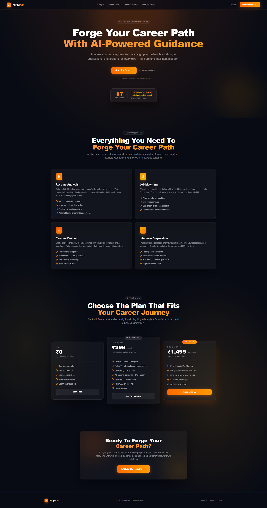

> Hero section with feature highlights, pricing plans, and CTA — dark themed with orange accent.

---

### 🔐 Login
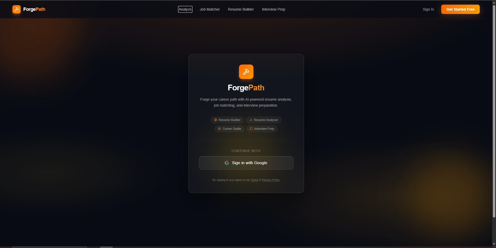

> One-click Google OAuth sign-in. No passwords required.

---

### 📄 Resume Analyzer
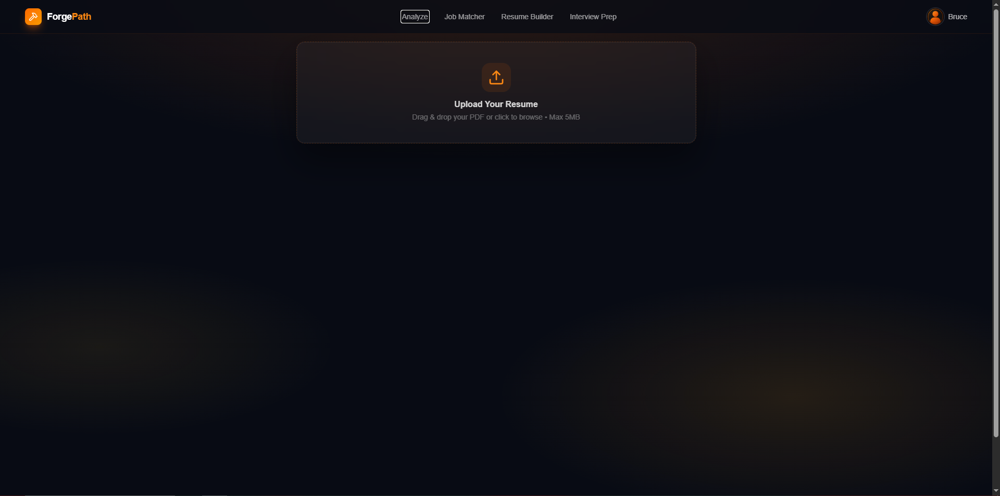

> Upload your PDF resume (max 5MB) for ATS scoring, keyword analysis, and actionable improvement suggestions.

---

### 💼 Job Matcher
| Enter Skills Manually | Upload Resume |
|---|---|
| 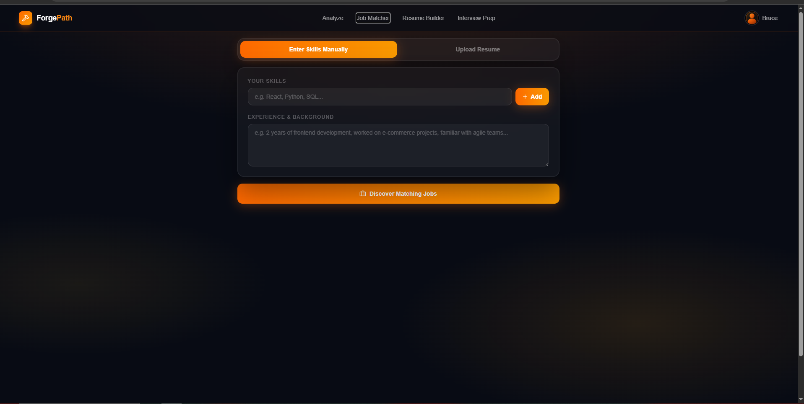 | 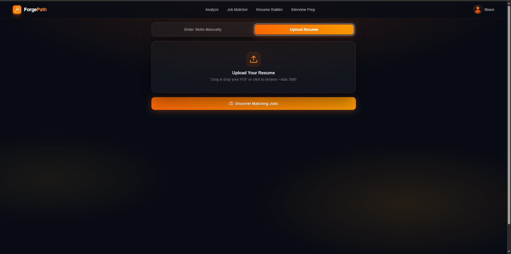 |

> Discover job roles matched to your skillset. Input skills manually or extract them directly from your resume PDF.

---

### 🏗️ Resume Builder
| Build From Scratch | Improve Existing Resume |
|---|---|
| 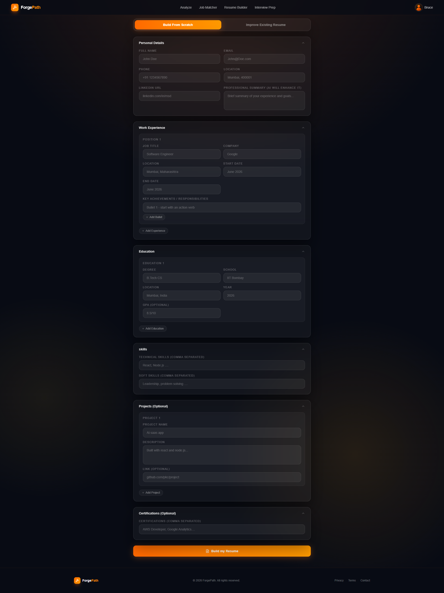 | 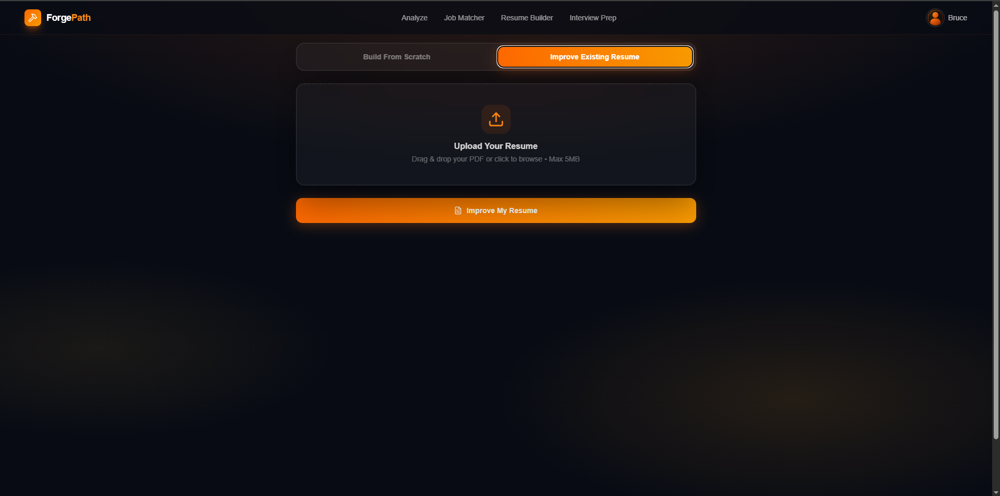 |

> Build a professional, ATS-friendly resume from scratch with AI-enhanced summaries, or upload an existing resume for AI-powered improvements. Export to PDF instantly.

---

### 🎤 Interview Prep
| HR Round (Manual) | Technical Round (Manual) | Upload Resume |
|---|---|---|
| 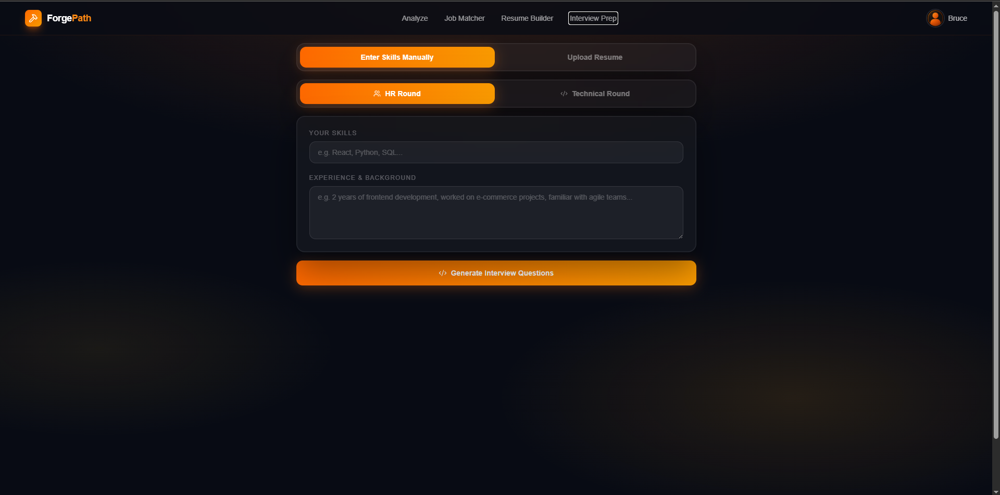 | 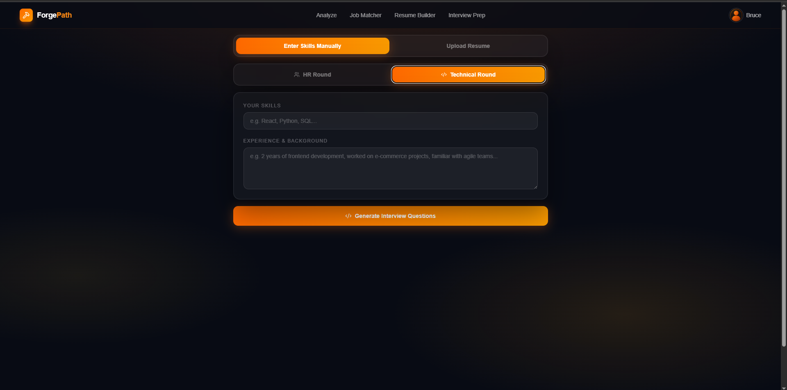 | 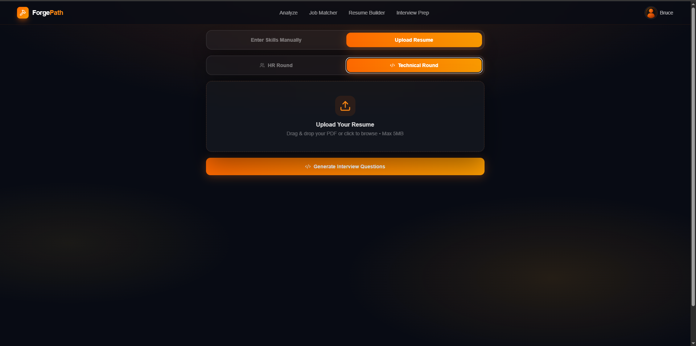 |

> Generate tailored interview questions for HR or Technical rounds. Enter your skills manually or let AI parse your resume.

---

### 👤 Account Page
| Free Plan | Pro Plan |
|---|---|
| 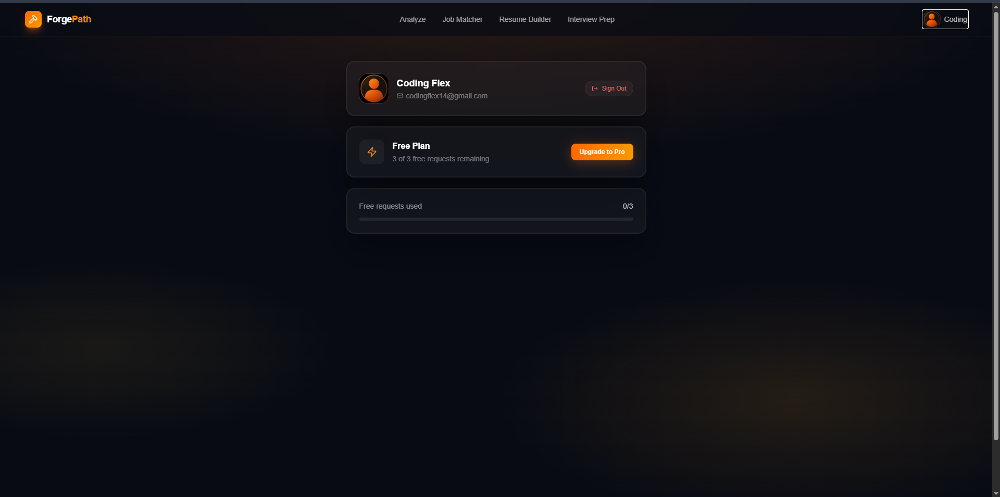 | 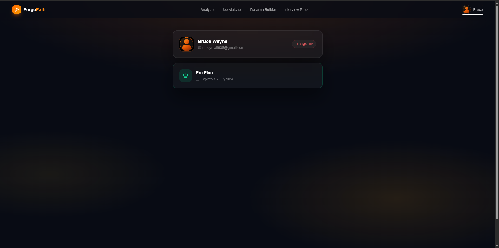 |

> Manage your subscription. Free users see remaining AI request quota; Pro users see their plan expiry date.

---

## ✨ Features

- **Resume Analysis** — ATS compatibility scoring, keyword optimization insights, section-by-section analysis, and actionable improvement suggestions
- **Job Matching** — AI-powered role matching with skill-fit percentage, gap analysis per position, and personalized recommendations
- **Resume Builder** — Build from scratch or improve an existing resume; AI-assisted content generation with ATS-friendly formatting and instant PDF export
- **Interview Preparation** — Role-specific HR and Technical questions, behavioral interview guidance, and AI-powered feedback
- **Google OAuth** — Frictionless sign-in with Google; no passwords
- **Subscription System** — Free tier (3 AI requests) + Pro Monthly (₹299) + Pro 6-Month (₹1,499) plans via Razorpay

---

## 🏛️ Architecture

ForgePath follows a classic **client → REST API → AI/DB/payments** architecture. The frontend never talks to Gemini or Razorpay directly — all AI calls and payment webhooks go through the Express backend, which also enforces authentication and usage quotas.

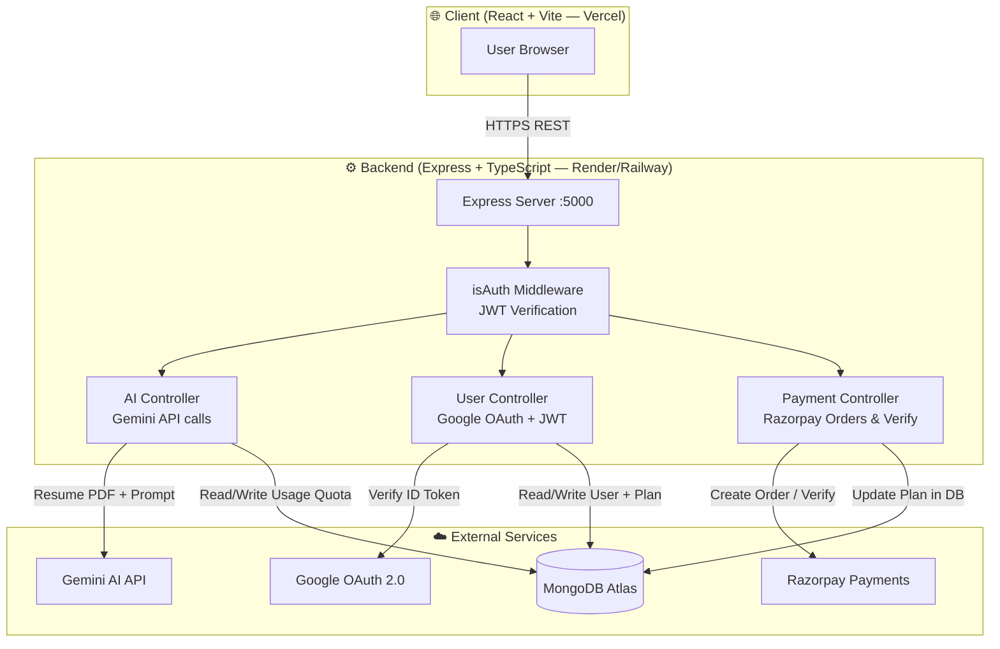

**Key design decisions:**
- **JWT auth** — stateless tokens; `isAuth` middleware gates all protected routes
- **Usage quota** — stored on the `User` model in MongoDB; checked before every AI call so the free tier is enforced server-side, not client-side
- **Prompt config** — all Gemini system prompts are centralized in `server/src/config/prompt.ts`, making them easy to tune without touching controller logic
- **trycatch middleware** — a global async error wrapper on all controllers keeps error-handling DRY

---

## 📡 API Overview

Base URL: `https://<your-backend-domain>/api`

All protected routes require the header:
```
Authorization: Bearer <jwt_token>
```

### Auth — `/api/user`

| Method | Endpoint | Auth | Description |
|--------|----------|------|-------------|
| `POST` | `/api/user/login` | ❌ | Exchange Google ID token for a ForgePath JWT. Creates user on first login. |
| `GET` | `/api/user/me` | ✅ | Get authenticated user profile and subscription status. |

### AI — `/api/ai`

| Method | Endpoint | Auth | Description |
|--------|----------|------|-------------|
| `POST` | `/api/ai/analyse` | ✅ | Upload resume PDF → returns ATS score, keyword gaps, and section analysis. Consumes 1 AI request. |
| `POST` | `/api/ai/job-matcher` | ✅ | Skills/resume → returns matched job roles with fit % and gap analysis. |
| `POST` | `/api/ai/resume-build` | ✅ | Form data → returns AI-enhanced resume content ready for PDF export. |
| `POST` | `/api/ai/interview` | ✅ | Skills/resume + round type (HR/Technical) → returns tailored interview questions. |

### Payments — `/api/payment`

| Method | Endpoint | Auth | Description |
|--------|----------|------|-------------|
| `POST` | `/api/payment/checkout` | ✅ | Create a Razorpay order for a given plan. Returns `order_id`. |
| `POST` | `/api/payment/verify` | ✅ | Verify Razorpay payment signature. Upgrades user plan in DB on success. |

> **Note:** Free plan users are limited to **3 AI requests total**, enforced server-side on every `/api/ai/*` call.

---

## 🛠️ Tech Stack

### Frontend (`/app`)
| Technology | Purpose |
|---|---|
| React 19 + TypeScript | UI framework |
| Vite 8 | Build tool & dev server |
| Tailwind CSS 4 | Styling |
| React Router DOM 7 | Client-side routing |
| `@react-oauth/google` | Google OAuth |
| Axios | HTTP client |
| jsPDF | PDF resume export |
| React Hot Toast | Notifications |
| Lucide React | Icons |

### Backend (`/server`)
| Technology | Purpose |
|---|---|
| Node.js + Express 5 | REST API server |
| TypeScript | Type safety |
| MongoDB + Mongoose | Database |
| `@google/genai` (Gemini) | AI features |
| Google APIs | OAuth verification |
| JWT (`jsonwebtoken`) | Authentication |
| Razorpay | Payment processing |
| Axios | HTTP requests |
| `cors` + `dotenv` | Middleware & config |

---

## 📁 Project Structure

```
ForgePath/
├── app/                          # Frontend (React + Vite)
│   ├── public/
│   └── src/
│       ├── assets/
│       ├── components/
│       │   ├── ctabanner.tsx
│       │   ├── features.tsx
│       │   ├── footer.tsx
│       │   ├── hero.tsx
│       │   ├── loading.tsx
│       │   ├── navbar.tsx
│       │   ├── pricing.tsx
│       │   ├── ProtectedRoutes.tsx
│       │   └── PublicRoutes.tsx
│       ├── context/
│       │   └── AppContext.tsx
│       ├── pages/
│       │   ├── Account.tsx
│       │   ├── Analyse.tsx
│       │   ├── BuildResume.tsx
│       │   ├── Home.tsx
│       │   ├── Interview.tsx
│       │   ├── JobMatcher.tsx
│       │   └── Login.tsx
│       ├── App.tsx
│       ├── main.tsx
│       ├── types.ts
│       └── utils.ts
│
└── server/                       # Backend (Node.js + Express)
    └── src/
        ├── config/
        │   ├── db.ts
        │   ├── googleconfig.ts
        │   └── prompt.ts
        ├── controllers/
        │   ├── ai.ts
        │   ├── payment.ts
        │   └── user.ts
        ├── middlewares/
        │   ├── isAuth.ts
        │   └── trycatch.ts
        ├── models/
        │   └── User.ts
        ├── routes/
        │   ├── ai.ts
        │   ├── payment.ts
        │   └── user.ts
        └── index.ts
```

---

## 🚀 Getting Started

### Prerequisites

- Node.js ≥ 18
- MongoDB instance (local or Atlas)
- Google Cloud project with OAuth 2.0 credentials
- Gemini API key
- Razorpay account

---

### 1. Clone the Repository

```bash
git clone https://github.com/jaikishan1234/ForgePath.git
cd forgepath
```

---

### 2. Backend Setup

```bash
cd server
```

Create a `.env` file in the `server/` root:

```env
PORT=5000

# MongoDB
MONGO_URI=mongodb+srv://<user>:<password>@cluster.mongodb.net/forgepath

# Google OAuth
GOOGLE_CLIENT_ID=your_google_client_id
GOOGLE_CLIENT_SECRET=your_google_client_secret

# JWT
JWT_SEC=your_jwt_secret_key

# Gemini AI
API_KEY_GEMINI=your_gemini_api_key

# Razorpay
Razorpay_Key=your_razorpay_key_id
Razorpay_Secret=your_razorpay_secret
```

Install dependencies and run:

```bash
npm install

# Development (watch mode)
npm run dev

# Production build
npm run build
npm run start
```

The server runs at `http://localhost:5000`.

---

### 3. Frontend Setup

```bash
cd app
```

Create a `.env` file in the `app/` root:

```env
VITE_BACKEND_URL=http://localhost:5000
VITE_GOOGLE_CLIENT_ID=your_google_client_id
```

Install dependencies and run:

```bash
npm install

# Development
npm run dev

# Production build
npm run build
npm run preview
```

The app runs at `http://localhost:5173`.

---

## 💳 Pricing

| Plan | Price | Features |
|---|---|---|
| **Free** | ₹0 | 3 AI requests, ATS score report, basic job matches, 1 resume template, community support |
| **Pro Monthly** | ₹299/month | Unlimited resume analyses, full ATS report, unlimited job matching, all resume templates + PDF export, unlimited interview prep, email support |
| **Pro 6-Month** | ₹1,499 | Everything in Pro Monthly + early access to new features, weekly AI resume review, LinkedIn profile tips, dedicated support |

---

## 🔐 Environment Variables Reference

| Variable | Description |
|---|---|
| `PORT` | Backend server port (default: `5000`) |
| `MONGO_URI` | MongoDB connection string |
| `GOOGLE_CLIENT_ID` | Google OAuth 2.0 Client ID |
| `GOOGLE_CLIENT_SECRET` | Google OAuth 2.0 Client Secret |
| `JWT_SEC` | Secret key for signing JWT tokens |
| `API_KEY_GEMINI` | Google Gemini AI API key |
| `Razorpay_Key` | Razorpay Key ID |
| `Razorpay_Secret` | Razorpay Key Secret |

---

## 📦 Available Scripts

### Backend
| Command | Description |
|---|---|
| `npm run dev` | Run in watch mode (TypeScript + Node) |
| `npm run build` | Compile TypeScript to `dist/` |
| `npm run start` | Start compiled production server |

### Frontend
| Command | Description |
|---|---|
| `npm run dev` | Start Vite dev server |
| `npm run build` | Type-check and build for production |
| `npm run preview` | Preview production build locally |
| `npm run lint` | Run ESLint |

---

## 🌐 Deployment

### Frontend → Vercel

1. Push your repo to GitHub.
2. Go to [vercel.com](https://vercel.com) → **Add New Project** → import your repo.
3. Set **Root Directory** to `app`.
4. Add environment variables in the Vercel dashboard:
   ```
   VITE_BACKEND_URL=https://your-backend-domain.com
   VITE_GOOGLE_CLIENT_ID=your_google_client_id
   ```
5. Deploy. Vercel auto-deploys on every push to `main`.

### Backend → Render

1. Go to [render.com](https://render.com) → **New Web Service** → connect your repo.
2. Set **Root Directory** to `server`.
3. Set **Build Command** to `npm run build`.
4. Set **Start Command** to `npm run start`.
5. Add all environment variables from `.env.example` in the Render dashboard.
6. Set **Node version** to `18` or higher.

> Make sure your MongoDB Atlas cluster allows connections from `0.0.0.0/0` (or Render's static IPs) under **Network Access**.

---

## 📄 License

This project is licensed under the **ISC License**.

---

<div align="center">
  <p>Built with ❤️ — <a href="https://github.com/jaikishan1234">Jaikishan Nayak</a></p>
  <p>
    <a href="https://forge-path-psi.vercel.app">🌐 Live Site</a>
  </p>
</div>
